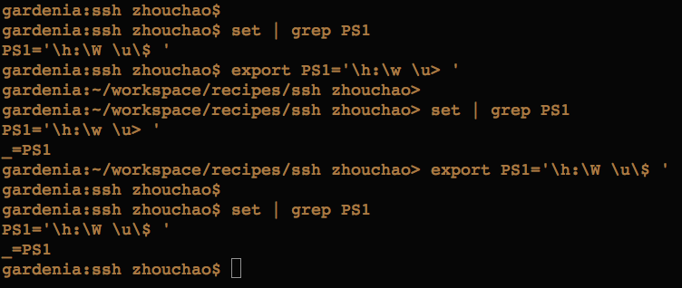
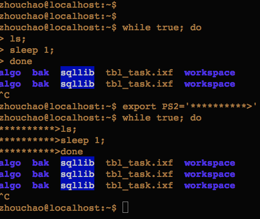

# 1 简介

## 提示符(prompt symbol)
1. 一级提示符, 

   * 一般情况下root提示符以`#`结尾, 如
   
     ```
     [root@ypcs /home/hary] #
     ```
   * 普通用户的提示符以`$`结尾
    
     ```
     [hary@ypcs /opt] $
     ```
   * 一级提示符是通过环境变量`$PS1`来设置值的
   * 例子
   
     


2. 二级提示符

   * 二级提示符是指命令的子命令的提示符
   * 二级提示符是通过环境变量`$PS2`来设置值的
   * 例子
   
     
     
3. 查看提示符设置

   ```
   hary@localhost:/$ set | grep PS
   GROUPS=()
   PS1='\[\e]0;\u@\h: \w\a\]${debian_chroot:+($debian_chroot)}\u@\h:\w\$ '
   PS2='> '
   PS4='+ '
   ```
   
   > \u \h \w \a的含义， 请baidu or google
   
## 运行shell脚本
1. 方式1

   ```
   bash myscript.sh
   ```
2. 方式2
 
   ```
   # 赋予myscript.sh可执行权限
   chmod +x myscript.sh
   ./myscript.sh
   ```

## 顺序执行命令
1. 在bash中, 每个命令是通过`;`或换行符来分割的如:

   ```
   gardenia:ssh zhouchao$ date
   2013年 6月21日 星期五 17时59分05秒 CST
   gardenia:ssh zhouchao$ pwd
   /Users/zhouchao/workspace/recipes/ssh
   gardenia:ssh zhouchao$ 
   ```

## 注释
1. 在linux基本都是基于行注释， 如

   ```
   gardenia:ssh zhouchao$ # 这是注释
   gardenia:ssh zhouchao$      # me too
   gardenia:ssh zhouchao$ 

   ```
   
## 终端打印
1. echo命令

   
   
   说明
   
   ```
   1. -e 包含转义序列的字符串
   2. 颜色输出
      - \e[1;31m  : 红色
      - \e[1;30m  : 黑色
      - \e[1;40m  : 黑色
      - \e[1;41m  : 黑色
      - \e[1;42m  : 黑色
      - \e[1;43m  : 黄色
      - \e[1;44m  : 蓝色
      - \e[1;45m  : 洋色
      - \e[1;46m  : 青色
      - \e[1;47m  : 白色
      - \e[0;m    : 颜色置回
      
   ```
2. printf命令

   ```
   gardenia:01 zhouchao$ cat  printf.sh 
   #!/bin/bash

   printf "%-5s %-10s %-4s\n"  NO. Name Mark
   printf "%-5s %-10s %-4s\n"  1 Sarath 80.3456
   printf "%-5s %-10s %-4s\n"  2 James 90.9989
   printf "%-5s %-10s %-4s\n"  3 Jeff 77.564
   gardenia:01 zhouchao$ ./printf.sh 
   NO.   Name       Mark
   1     Sarath     80.3456
   2     James      90.9989
   3     Jeff       77.564
   gardenia:01 zhouchao$ 
   ```
   
## 变量与环境变量

1. 当前进程PID: $$

   ```
   hary@localhost:~$ cat /proc/$$/environ | tr '\0' '\n'
   LANG=en_HK.UTF-8
   USER=hary
   LOGNAME=hary
   HOME=/home/hary
   PATH=/usr/local/sbin:/usr/local/bin:/usr/sbin:/usr/bin:/sbin:/bin:/usr/games
   MAIL=/var/mail/hary
   SHELL=/bin/bash
   SSH_CLIENT=192.168.100.254 53298 22
   SSH_CONNECTION=192.168.100.254 53298 172.17.253.126 22
   SSH_TTY=/dev/pts/8
   TERM=xterm-256color
   LANGUAGE=en_HK:en 
   ```
   > /proc文件系统
   
2. HOME目录: $HOME, ~, ~user

   ```
   hary@localhost:/$ echo $HOME
   /home/hary
   hary@localhost:/$ echo ~
   /home/hary
   hary@localhost:/$ echo ~ltl
   /home/ltl/
   hary@localhost:/$ 
   ```

3. 登录名: $LOGNAME

   ```
   hary@localhost:/$ echo $LOGNAME
   hary
   hary@localhost:/$ 
   ```
   
4. 当前目录: $PWD

   ```
   hary@localhost:~$ echo $PWD
   /home/hary
   hary@localhost:~$ cd /
   hary@localhost:/$ echo $PWD
   /
   hary@localhost:/$ 
   ```
   
5. 当前SHELL: $SHELL

   ```
   hary@localhost:~$ echo $SHELL
   /bin/bash
   hary@localhost:~$
   ```
   
6. 可执行文件查找目录: $PATH

   ```
   hary@localhost:~$ echo $PATH
   /usr/local/sbin:/usr/local/bin:/usr/sbin:/usr/bin:/sbin:/bin:/usr/games
   hary@localhost:~$ which vi
   /usr/bin/vi
   hary@localhost:~$ 
   ```
   
   > which命令用来查看命令所在位置的
      

7. env命令, 查看当前环境变量

   ```
   hary@localhost:~$ env
   TERM=xterm-256color
   SHELL=/bin/bash
   SSH_CLIENT=192.168.100.254 53298 22
   SSH_TTY=/dev/pts/8
   USER=hary
   LS_COLORS=rs=0:di=01;34:ln=01;36:mh=00:pi=40;33:so=01;35:do=01;35:bd=40;33;01:cd=40;33;01:or=40;31;01:su=37;41:sg=30;43:ca=30;41:tw=30;42:ow=34;42:st=37;44:ex=01;32:*.tar=01;31:*.tgz=01;31:*.arj=01;31:*.taz=01;31:*.lzh=01;31:*.lzma=01;31:*.tlz=01;31:*.txz=01;31:*.zip=01;31:*.z=01;31:*.Z=01;31:*.dz=01;31:*.gz=01;31:*.lz=01;31:*.xz=01;31:*.bz2=01;31:*.bz=01;31:*.tbz=01;31:*.tbz2=01;31:*.tz=01;31:*.deb=01;31:*.rpm=01;31:*.jar=01;31:*.war=01;31:*.ear=01;31:*.sar=01;31:*.rar=01;31:*.ace=01;31:*.zoo=01;31:*.cpio=01;31:*.7z=01;31:*.rz=01;31:*.jpg=01;35:*.jpeg=01;35:*.gif=01;35:*.bmp=01;35:*.pbm=01;35:*.pgm=01;35:*.ppm=01;35:*.tga=01;35:*.xbm=01;35:*.xpm=01;35:*.tif=01;35:*.tiff=01;35:*.png=01;35:*.svg=01;35:*.svgz=01;35:*.mng=01;35:*.pcx=01;35:*.mov=01;35:*.mpg=01;35:*.mpeg=01;35:*.m2v=01;35:*.mkv=01;35:*.webm=01;35:*.ogm=01;35:*.mp4=01;35:*.m4v=01;35:*.mp4v=01;35:*.vob=01;35:*.qt=01;35:*.nuv=01;35:*.wmv=01;35:*.asf=01;35:*.rm=01;35:*.rmvb=01;35:*.flc=01;35:*.avi=01;35:*.fli=01;35:*.flv=01;35:*.gl=01;35:*.dl=01;35:*.xcf=01;35:*.xwd=01;35:*.yuv=01;35:*.cgm=01;35:*.emf=01;35:*.axv=01;35:*.anx=01;35:*.ogv=01;35:*.ogx=01;35:*.aac=00;36:*.au=00;36:*.flac=00;36:*.mid=00;36:*.midi=00;36:*.mka=00;36:*.mp3=00;36:*.mpc=00;36:*.ogg=00;36:*.ra=00;36:*.wav=00;36:*.axa=00;36:*.oga=00;36:*.spx=00;36:*.xspf=00;36:
   MAIL=/var/mail/hary
   PATH=/usr/local/sbin:/usr/local/bin:/usr/sbin:/usr/bin:/sbin:/bin:/usr/games
   PWD=/home/hary
   LANG=en_HK.UTF-8
   SHLVL=1
   HOME=/home/hary
   LANGUAGE=en_HK:en
   LOGNAME=hary
   SSH_CONNECTION=192.168.100.254 53298 172.17.253.126 22
   LESSOPEN=| /usr/bin/lesspipe %s
   LESSCLOSE=/usr/bin/lesspipe %s %s
   _=/usr/bin/env
   hary@localhost:~$ 
   ```
   
   > set命令与envrion命令的区别

## 数学运算
1. let命令
   
   ```
   gardenia:01 zhouchao$ cat let.sh 
   #!/bin/bash

   a=1
   b=2

   let c=a+b       # c = 3
   echo "c = $c";

   let d=a+b+c*2   # d = 9. 1+2+3*2 
   echo "d = $d";

   let d--;        # d = 8;
   echo "d = $d";

   let d++;        # d= 9;
   echo "d = $d";

   let d+=100      # d = 109
   echo "d = $d";

   gardenia:01 zhouchao$ ./let.sh 
   c = 3
   d = 9
   d = 8
   d = 9
   d = 109
   gardenia:01 zhouchao$
   ```

2. [], (())与数学运算

   ```
   gardenia:01 zhouchao$ cat sb.sh 
   #!/bin/bash

   a=1
   b=2

   c=$[ 1 + 2 ]      # c = 3
   echo "c = $c";

   d=$[ a + b * c ]  # d = 7
   echo "d = $d";

   d=$[$a+$b*$c]     # d = 7
   echo "d = $d";

   d=$((a+b*c));     # d = 7
   echo "d = $d";

   ((d=a+b*c*100));  # d = 1 + 2*3*100 = 601
   echo "d = $d";

   gardenia:01 zhouchao$ ./sb.sh 
   c = 3
   d = 7
   d = 7
   d = 7
   d = 601
   gardenia:01 zhouchao$ 
   ```

3. expr命令

   ```
   gardenia:01 zhouchao$ cat expr.sh 
   #!/bin/bash

   a=1
   b=2

   c=$(expr $b + $a);   echo "c = $c";   # 3
   c=$(expr $b - $a);   echo "c = $c";   # 1
   c=$(expr $b \* $a);  echo "c = $c";   # 2
   c=$(expr $b \/ $a);  echo "c = $c";   # 2

   gardenia:01 zhouchao$ ./expr.sh 
   c = 3
   c = 1
   c = 2
   c = 2
   gardenia:01 zhouchao$
   ```
   
4. 以上的计算命令都只能针对整数， 浮点数计算, 需要bc命令

   ```
   gardenia:01 zhouchao$ cat bc.sh 
   #!/bin/bash

   result=$(echo "4*0.56+(1+100)*100/2" | bc)
   echo "result = $result";

   result=$(echo "scale=2; 3/8" | bc)    # 保持两位精度
   echo "result = $result";

   result=$(echo "obase=16;255" | bc)    # 10进制转16进制: FF
   echo "result = $result";

   result=$(echo "obase=16;ibase=2;11111111" | bc)  # 16进制转2进制: FF
   echo "result = $result";

   result=$(echo "sqrt(100)" | bc);  # 平方根: 10
   echo "result = $result";

   result=$(echo "10^8" | bc);       # 幂运算: 100000000
   echo "result = $result";


   gardenia:01 zhouchao$ ./bc.sh 
   result = 5052.24
   result = .37
   result = FF
   result = FF
   result = 10
   result = 100000000
   gardenia:01 zhouchao$ 
   ```
   
## 文件描述符与重定向

1. 三个预留的文件描述符
   1. 标准输入(stdin)   0
   2. 标准输出(stdout)  1
   3. 标准出错(stderr)  2
   
2. 重定向

   ```
   gardenia:01 zhouchao$ cat fd.sh 
   #!/bin/bash

   # 标准输出重定向 方式1
   echo "--------------T1--------------";
   echo "test1" > /tmp/t1
   cat /tmp/t1

   # 标准输出重定向 方式2
   echo "--------------T2--------------";
   echo "test2" 1>/tmp/t2
   cat /tmp/t2

   # 标准出错重定向
   echo "--------------T3--------------";
   "not exist cmd" 2>/tmp/t3
   cat /tmp/t3

   # 标准输出,出错都重定向
   echo "--------------T4--------------";
   (echo "test4"; "我输入的不存在的命令";) >/tmp/t4 2>&1
   cat /tmp/t4

   # 标准出错都重定向到/dev/null
   echo "--------------T5--------------";
   (echo "test5"; "我输入的不存在的命令";) >/tmp/t4 2>&1
   cat /tmp/t5
   
   gardenia:01 zhouchao$ ./fd.sh 
   --------------T1--------------
   test1
   --------------T2--------------
   test2
   --------------T3--------------
   ./fd.sh: line 15: not exist cmd: command not found
   --------------T4--------------
   test4
   ./fd.sh: line 20: 我输入的不存在的命令: command not found
   --------------T5--------------
   test5
   ```
   
3. tee命令

   ```
   hary@localhost:/$ echo "this is a test" | tee /tmp/t1 -
   this is a test
   this is a test
   hary@localhost:/$ cat /tmp/t1
   this is a test
   ```
   > 第一条命令中, 标准输出有两行是以为`tee -`
   
4. 将文件重定向到命令

   ```
   gardenia:01 zhouchao$ cat cmd.dat 
   10+(10+2)*100/2
   gardenia:01 zhouchao$ bc < cmd.dat
   610
   gardenia:01 zhouchao$
   ```

5. 追加模式的重定向 

   ```
   gardenia:01 zhouchao$ touch /tmp/append.dat
   gardenia:01 zhouchao$ echo "content 1" > /tmp/append.dat
   gardenia:01 zhouchao$ cat /tmp/append.dat 
   content 1
   gardenia:01 zhouchao$ echo "content 2" >> /tmp/append.dat
   gardenia:01 zhouchao$ cat /tmp/append.dat 
   content 1
   content 2
   gardenia:01 zhouchao$
   ```
   
6. HereDoc语法

   ```
   gardenia:01 zhouchao$ cat heredoc.sh 
   #!/bin/bash
   a=10
   b=100

   echo "---------------T1--------------"
   cat <<-EOF;   # "这里'-'的意思是discard制表符\t"
   	第一行: $a
   	第二行: $b
   EOF

   echo "---------------T2--------------"
   cat <<'EOF';
   	第一行: $a
   	第二行: $b
   EOF

   gardenia:01 zhouchao$ ./heredoc.sh 
   ---------------T1--------------
   第一行: 10
   第二行: 100
   ---------------T2--------------
       第一行: $a
   	   第二行: $b
   ```
   > 其实可以将heredoc理解为追加模式的重定向

7. exec打开文件读写

   ```
   gardenia:01 zhouchao$ cat exec.sh 
   #!/bin/bash


   # 打开文件, 向文件写与读
   exec 3>/tmp/k1
   exec 4</tmp/k1

   # 通过3写到/tmp/k1
   cat <<EOF 1>&3
   a
   b
   c
   EOF

   # 通过4读取/tmp/k1
   cat <&4

   gardenia:01 zhouchao$ ./exec.sh 
   a
   b
   c
   gardenia:01 zhouchao$
   ``` 
   
## 使用别名

1. 例子

   ```
   gardenia:lssc zhouchao$ alias l='ls -lrt';
   gardenia:lssc zhouchao$ l
   total 46384
   -rw-rw-r--   1 zhouchao  staff         0  6 21 17:18 02.md
   -rw-rw-r--   1 zhouchao  staff         0  6 21 17:18 03.md
   -rw-rw-r--   1 zhouchao  staff         0  6 21 17:18 04.md
   -rw-rw-r--   1 zhouchao  staff         0  6 21 17:18 05.md
   -rw-rw-r--   1 zhouchao  staff         0  6 21 17:18 06.md
   ```

## 时间

## 脚本调试

## 函数与参数

1. bash的函数其实是一个进程组. 

2. 参数
   - $1, $2, ... $N: 第N个参数
   - "$@" 被扩展为 "$1" "$2" ... "$N"等
   - "$*" 被扩展为 "$1c$2c$3", 其中c为IFS的第一个字符. 用得很少(因为他把参数当做单个字符串)

3. 返回值(其实就是进程组的最后退出状态, 获取方式为$?), bash是通过标准输出与进程替换来达到返回值的效果的
4. 例子
   
   ```
   gardenia:01 zhouchao$ cat func.sh 
   #!/bin/bash

   function f1 {
      echo "$@";
      echo "$*";
      echo "$1, $2";
      return 2;   # 进程组退出状态
   }

   result=$(f1 a b c);
   echo "status = $?"
   echo "result = [$result]";

   gardenia:01 zhouchao$ ./func.sh 
   status = 2
   result = [a b c
   a b c
   a, b]
   gardenia:01 zhouchao$ 
   ```

## 管道(PIPE)
1. 管道作用是: 一个进程的标准输出为另外一个进程的标准输入
2. 语法为: `cmd_a | cmd_b`
3. 函数导出: `export -f functionname`
4. 例子

   

## 进程替换(process substitution)
1. 作用: 将进程的标准输出的内容保存到一个变量中
2. 语法1: `var=\`cmd\``
3. 语法2: `var=$(cmd)`
4. 例子

   ```
   gardenia:ssh zhouchao$ date +%Y%m%d
   20130621
   gardenia:ssh zhouchao$ var=`date +%Y%m%d`
   gardenia:ssh zhouchao$ echo $var
   20130621
   gardenia:ssh zhouchao$ var2=$(date +%Y%m%d)
   gardenia:ssh zhouchao$ echo $var2
   20130621
   gardenia:ssh zhouchao$ 
   ```

## 子shell
1. 将多个进程组合顺序运行
2. 语法: (cmd1; cmd2; ... cmdn)
3. 例子
  
   ```
   gardenia:ssh zhouchao$ date +%H%M%S; sleep 3; date +%H%M%S;
   214214
   214217
   gardenia:ssh zhouchao$ var=$(date +%H%M%S; sleep 3; date +%H%M%S)
   gardenia:ssh zhouchao$ echo $var
   214240 214243
   gardenia:ssh zhouchao$ 
   gardenia:ssh zhouchao$ for t in `date +%H%M%S; sleep 3; date +%H%M%S;`; do echo "time:$t"; done
   time:214503
   time:214506
   gardenia:ssh zhouchao$ 
   ```

## read命令(-n, -s, -t, -p, -d)
1. `read -n 4 var` 读4个字符到变量var
2. `read -t 2 var` 2秒超时读取
3. `read -p "Enter choice[Y/N]: " var` 带提示符的读取
4. `read -s -p "Enter password: "` 不回显,带提示符读取
5. `read -d ':' var` 以':'为分隔符读取变量到var

## 字段分隔符与循环

1. IFS与for

   ```
   #!/bin/bash
   data="name,sex,rollno,location";
   oldIFS=$IFS
   IFS=,
   for item in $data; do
       echo $item;
   done
   IFS=$oldIFS  # 重置回来IFS
   gardenia:01 zhouchao$ ./for.sh 
   name
   sex
   rollno
   location
   ```

2. (())与for循环

   ```
   gardenia:01 zhouchao$ cat for2.sh 
   #!/bin/bash

   for ((i=0;i<5;i++)) {
       echo $i; 
   }

   gardenia:01 zhouchao$ ./for2.sh 
   0
   1
   2
   3
   4
   gardenia:01 zhouchao$
   ```
   
3. while循环

   ```
   gardenia:01 zhouchao$ cat while.sh 
   #!/bin/bash

   a=1;
   while [[ $a < 3 ]]; do
       echo "$a";
       ((a+=1));
   done
   gardenia:01 zhouchao$ ./while.sh 
   1
   2
   gardenia:01 zhouchao$
   ```
   
4. 技巧(经常与for配合)

   ```
   gardenia:01 zhouchao$ echo {a..z}
   a b c d e f g h i j k l m n o p q r s t u v w x y z
   gardenia:01 zhouchao$ echo {0..10}
   0 1 2 3 4 5 6 7 8 9 10
   gardenia:01 zhouchao$ seq 1 10
   gardenia:01 zhouchao$ seq 1 5标准
   1
   2
   3
   4
   5
   gardenia:01 zhouchao$ for v in `echo {0..3}`; do echo $v; done
   0
   1
   2
   3
   gardenia:01 zhouchao$
   ```
   
## 比较与测试
1. 数字比较
   - 等于 : `[ $var -eq 10 ]`
   - 不等于 : `[ $var -ne 10 ]`
   - 大于等于 : `[ $var -ge 10 ]`
   - 小于等于 : `[ $var -le 10 ]`
   - 大于 : `[ $var -gt 10 ]`
   - 小于 : `[ $var -lt 10 ]`
   - 小于10且大于5 : `[ $var -lt 10 -a $var -gt 5 ]`
   - 大于10或小于5 : `[ $var -gt 10 -o $var -lt 5 ]`

2. 字符串比较

   - 相等 : `[[ $s1 = $s2 ]]` 或者是 `[[ $s1 == $s2 ]]`
   - 大于 : `[[ $s1 > $s2 ]]`
   - 小于 : `[[ $s1 < $s2 ]]`
   - 不等于: `[[ $s1 != $s2 ]]`
   - 空串 : `[[ -z $str ]]`
   - 非空 : `[[ -n $str ]]`
   - 并且组合 : `[[ $str1 > $stra ]] && [[ $str1 <  $strb ]]`
   - 或组合   : `[[ $str1 > $stra ]] || [[ $str1 < $strb ]]`
   
3. 文件测试

   - 目录测试 : `[ -d $dir ]`
   - 文件测试 : `[ -f $file ]`
   - 可执行否 : `[ -x $file ]`
   - 可读否  : `[ -r $file ]`
   - 可写否  : `[ -w $file ]`
   - 存在否  : `[ -e $file ]`
   
4. 条件语句if-then-else-fi

   - if condition; then action; fi
   - if condition; then action; elif condition; then action; else action fi
   - [ condition ] && action
   - [ condition ] || action
   
5. 例子

   ```
   gardenia:01 zhouchao$ cat cmp.sh 
   #!/bin/bash

   # 数字比较
   if [ 10 -gt 5 -a 90 -lt 100 ]; then
       echo "10 > 5 并且 90 < 100";
   fi

   # 字符串比较
   if [[ "aby" > "abx" ]] && [[ "aby" < "abz" ]]; then
       echo "abx  < aby < abz";
   fi

   # 文件测试
   if [ -e "./cmp.sh" -a -x "./cmp.sh" ]; then
       echo "cmp.sh存在且可执行";
   fi
   gardenia:01 zhouchao$ ./cmp.sh 
   10 > 5 并且 90 < 100
   abx  < aby < abz
   cmp.sh存在且可执行
   ```

## links
  * [目录](<preface.md>)
  * 下一章: [命令之乐](<02.md>)
